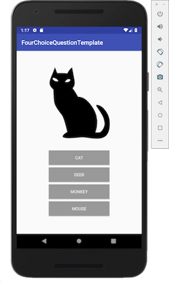

# Androidでクイズアプリ構築
2018.10.16

Android Studioのインストールについては、別紙(setup.key)を参照してください。
本解説は、Android Studio 3.2.1をベースに作成しています。
スクリーンショットが一部、3.1.4ベースになっていますが、相違点がある場合は明記します。

## 作成するプロジェクト
今回はクイズアプリを作成します。下記は最初の画面です。
クイズのカテゴリーが表示されています。カテゴリーを選択するとクイズ画面に遷移します。


画面下部の4つの選択肢から画像に適した物を選びます。



正解すると下記のように「◯」印が表示されます。


不正解の場合、「x」印が表示されます。


「◯」「x」印が表示された状態でタップすると次のクイズへ遷移します。
以上が一連の流れです。

## 新しいプロジェクトの作成
Android Studioを起動します。「Start a new Android Studio project」を選んで新しいプロジェクトを作成（開始）しましょう。


アプリの名前などを決定します。半角の英語で設定してください。


「Target Android Device」などは表示されているままで、そのまま進んでください。
アクティビティは「Empty Activity」を選びます。


この後、プロジェクトの作成と初回のビルドが開始されます。少し待ちましょう。
（この間に、どんなボタンがあるか等、色々覗いて回りましょう）

ビルド完了後、「Code -> Convert Java to Kotlin」と操作して、
プロジェクトをKotlinに変換します。

## アプリケーションの実行

USBケーブルで開発用のマシンとAndroidデバイスを接続してください。
「Connected Devices」の欄にデバイスが表示されていれば、問題ありません。
初回はAndroid端末側で操作が必要なこともありますので、うまくいかない場合は、
Android側の画面も確認して、何か指示やエラーが出ていないかを確認してください。

デバイスが表示されていれば「Ok」をクリックすると、Androidにプログラムが転送され、
アプリが起動します（画面の真ん中にHello world!と表示されます）。

## 新しい画面を追加する

MainActivity.kt 上で右クリックし「New -> Activity -> Empty Activity」を選択し、QuizActivitiy.ktとactivity_quiz.xmlを作成します。


## ボタンを作る

activity_quiz.xmlを編集して、以下のようなレイアウトを作成します。
Androidの端末は様々な画面サイズのものが存在するため、どの画面で見ても使いやすい配置を心がける必要があります。
そのため、画面の座標(x,y)や大きさ(width,height)を直接していするのではなく、相対的な指定、例えば、
画面の端からどのくらい、とか手前のボタンからどのくらい、といった指定を繰り返してボタンや画像を配置することになります。


## 画像を配置する
必要な画像は、自分たちで集めて貰ってもOKですが、著作権に注意してください。
今回のサンプルアプリで使用している画像は、以下のURLからダウンロードできます。
（URLが長いので、まずはgithub.comにアクセスしたあと、four-choice-questionリポジトリを検索した方が確実かもしれません）

https://github.com/lumbermill/four-choice-question/tree/master/assets/images

以下のような著作権フリーの素材から選んできても構いません。

https://www.irasutoya.com/


画像を取得したらres/drawable/に画像をコピーします。

## Kotlinの書き方
「File -> New -> Scratch File」メニューから「Kotlin」を選択します。
「Use REPL」にチェックを入れます。

下記のサイトを使用してKotlinの書き方を説明します。

- 日本語リファレンス(少し古いです)
    https://dogwood008.github.io/kotlin-web-site-ja/docs/reference/
- 逆引きKotlin
    http://kotlin-rev-solution.herokuapp.com/site/


```java
print("Hello, World.")

var animals = arrayListOf("hedgehog","dog","turkey")
print(animals)
print(animals[1])
// 存在しない番号はエラーになる
print(animals[3])

// 追加
animals.add("cow")
print(animals)

// 配列を追加する
var ape = arrayListOf("gorilla", "pongo")
animals.addAll(ape)
print(animals)

// 上書き
animals[2] = "bird"
print(animals)

// 中身を検索して削除
animals.remove("dog")
print(animals)

// インデックスを指定して削除
animals.removeAt(1)
print(animals)

var points = hashMapOf("taro" to 3, "jiro" to 5)
print(points)
print(points["taro"])
// 存在しないキーだとnullが返ってくる
print(points["saburo"])

// 追加
points["siro"] = 7
print(points)

// 上書き
points["jiro"] = 4
print(points)

// キーを指定して削除
points.remove("jiro")
print(points)
```

## クイズのデータを作成する
プログラムの他にデータ（クイズの問題）が必要です。
```
class Context {
    companion object {
        // クイズの問題をここに定義します。
        // クイズは表示された絵を見て、それに該当する答えを四つの選択肢の中から選ぶものです
        // 一つの問題は長さが4の配列から成り、表示される絵は常に先頭のものとします（先頭が正解）
        // 問題を複数個集めた配列が一つの問題集となります
        // 問題集のタイトルをキー、問題集本体（=問題の配列）を値としたハッシュ(questions)を定義します
        val questions: HashMap<String, ArrayList<ArrayList<String>>> = hashMapOf(
            "animal" to arrayListOf(
                arrayListOf("monkey", "money", "monk", "mosquito"),
                arrayListOf("horse", "bonito", "mouse", "sheep"),
                arrayListOf("deer", "bear", "lion", "cow")
            ),
            "fish" to arrayListOf(
                arrayListOf("tuna", "octopus", "turtle", "mango")
            )
        )
    }
}
```


## MainActivity作成
### activity_main.xml
```xml
<?xml version="1.0" encoding="utf-8"?>
<android.support.constraint.ConstraintLayout
        xmlns:android="http://schemas.android.com/apk/res/android"
        xmlns:tools="http://schemas.android.com/tools"
        xmlns:app="http://schemas.android.com/apk/res-auto"
        android:layout_width="match_parent"
        android:layout_height="match_parent"
        tools:context=".MainActivity">

	<!-- 画面一杯にListViewを表示するため`layout_width`と`layout_height`に`match_parent`を指定します -->
    <!-- `android:id="@+id/xxxx"`でプログラムから参照する際のidを指定します -->
    <ListView
            android:id="@+id/listview"
            android:layout_width="match_parent"
            android:layout_height="match_parent" />

</android.support.constraint.ConstraintLayout>
```

### MainActivity.kt
```
import android.content.Intent
import android.support.v7.app.AppCompatActivity
import android.os.Bundle
import android.widget.ArrayAdapter
import android.widget.ListView

// メイン画面
// 問題集の一覧を表示します
class MainActivity : AppCompatActivity() {

    override fun onCreate(savedInstanceState: Bundle?) {
        super.onCreate(savedInstanceState)
        setContentView(R.layout.activity_main)

        // レイアウトで追加したリストビューを呼び出します
        val listView = findViewById<ListView>(R.id.listview)
        // Context.ktで定義した問題のタイトルを取得します
        val titles = Context.questions.keys.toTypedArray()
        //
        listView.adapter = ArrayAdapter<String>(this, android.R.layout.simple_list_item_1, titles)
        // リストの項目がタップされた際の動作を定義します
        listView.setOnItemClickListener { _, _, i, _ ->
            // タップされた項目のタイトルをクイズ画面に渡して、クイズ画面に遷移します
            val intent = Intent(this, QuizActivity::class.java)
            intent.putExtra("name", titles[i])
            startActivity(intent)
        }
    }
}
```

## QuizActivity作成
### activity_quiz.xml
```xml
<?xml version="1.0" encoding="utf-8"?>
<android.support.constraint.ConstraintLayout
        xmlns:android="http://schemas.android.com/apk/res/android"
        xmlns:tools="http://schemas.android.com/tools"
        xmlns:app="http://schemas.android.com/apk/res-auto"
        android:layout_width="match_parent"
        android:layout_height="match_parent"
        tools:context=".QuizActivity">

    <Button
            android:text="@string/button"
            android:layout_width="wrap_content"
            android:layout_height="wrap_content"
            android:id="@+id/button1"
            android:layout_marginBottom="8dp"
            app:layout_constraintBottom_toTopOf="@+id/button2"
            app:layout_constraintStart_toStartOf="@+id/button2"
            app:layout_constraintEnd_toEndOf="@+id/button2"
            android:onClick="onClick"/>
    <Button
            android:text="@string/button"
            android:layout_width="wrap_content"
            android:layout_height="wrap_content"
            android:id="@+id/button2"
            android:layout_marginBottom="8dp"
            app:layout_constraintBottom_toTopOf="@+id/button3"
            app:layout_constraintStart_toStartOf="@+id/button3"
            app:layout_constraintEnd_toEndOf="@+id/button3"
            android:onClick="onClick"/>
    <Button
            android:text="@string/button"
            android:layout_width="wrap_content"
            android:layout_height="wrap_content"
            android:id="@+id/button3"
            android:layout_marginBottom="8dp"
            app:layout_constraintBottom_toTopOf="@+id/button4"
            app:layout_constraintStart_toStartOf="@+id/button4"
            app:layout_constraintEnd_toEndOf="@+id/button4"
            android:onClick="onClick"/>
    <Button
            android:text="@string/button"
            android:layout_width="wrap_content"
            android:layout_height="wrap_content"
            android:id="@+id/button4"
            app:layout_constraintBottom_toBottomOf="parent"
            android:layout_marginBottom="32dp"
            app:layout_constraintStart_toStartOf="parent"
            app:layout_constraintEnd_toEndOf="parent"
            android:onClick="onClick"/>
    <ImageView
            android:layout_width="382dp"
            android:layout_height="196dp"
            tools:srcCompat="@tools:sample/avatars"
            android:id="@+id/imageView"
            android:layout_marginBottom="32dp"
            app:layout_constraintBottom_toTopOf="@+id/button1"
            app:layout_constraintTop_toTopOf="parent"
            android:layout_marginTop="8dp"
            app:layout_constraintStart_toStartOf="parent"
            app:layout_constraintEnd_toEndOf="parent"
            android:scaleType="centerInside"
            android:contentDescription="@string/app_name"/>
    <Button
            android:id="@+id/overlay"
            app:layout_constraintTop_toTopOf="parent"
            app:layout_constraintStart_toStartOf="parent"
            app:layout_constraintEnd_toEndOf="parent"
            app:layout_constraintBottom_toBottomOf="parent"
            android:background="@drawable/correct"
            android:onClick="onClickOverlay"
            android:layout_width="0dp"
            android:layout_height="0dp"
            app:layout_constraintDimensionRatio="1"/>
</android.support.constraint.ConstraintLayout>
```


### QuizActivity.kt
```
import android.content.Intent
import android.media.MediaPlayer
import android.support.v7.app.AppCompatActivity
import android.os.Bundle
import android.view.View
import android.widget.Button
import android.widget.ImageView

// クイズ画面
class QuizActivity : AppCompatActivity() {
    // 画面全体を覆う透明なボタン
    private lateinit var overlay:Button
    // 現在表示している問題の位置
    private var index: Int = 0
    // 現在の得点
    private var score: Int = 0
    // 現在表示している問題の正解
    private var correctAnswer: String = ""
    // 現在の問題集（=問題の配列）
    private var questions: ArrayList<ArrayList<String>>? = arrayListOf(arrayListOf(""))
    // 正解の音
    private lateinit var soundCorrect:MediaPlayer
    // 不正解の音
    private lateinit var soundWrong:MediaPlayer

    override fun onCreate(savedInstanceState: Bundle?) {
        super.onCreate(savedInstanceState)
        setContentView(R.layout.activity_quiz)

        // 正解、不正解の画像を表示するボタンを取得します
        overlay = findViewById(R.id.overlay)

        // 正解の時、不正解の時の音を準備します
        soundCorrect = MediaPlayer.create(this, R.raw.se_maoudamashii_chime13)
        soundWrong = MediaPlayer.create(this, R.raw.se_maoudamashii_onepoint33)

        // メイン画面で指定された問題集のタイトルを取得します
        val name = intent.getStringExtra("name")
        // タイトルに一致する問題集本体(=問題の配列)を取得します
        questions = Context.questions[name]

        if (questions == null) {
            // 問題が取得できなかったとき
            // * Context.ktに直接問題が定義されている今回は、ここに到達することはありません
            //   しかし、外部から問題を読んできて表示するような場合、こうしたエラー処理が大切です
            update(arrayListOf("wrong","","",""))
        }
        questions?.let {
            // 問題集が取得できた時、
            // 現在位置とスコアを0にリセットして、最初から問題を開始します
            index = 0
            score = 0
            update(it[index])
        }
    }

    // 選択肢(四択)を配列で受け取って、クイズ画面を更新するメソッド
    private fun update(options: ArrayList<String>){
        // 正解・不正解の表示を消去します
        overlay.isEnabled = false
        overlay.setBackgroundResource(0)

        // 画像を表示するビューと四択を表示するボタンを取得します
        val imageView = findViewById<ImageView>(R.id.imageView)
        val btn1 = findViewById<Button>(R.id.button1)
        val btn2 = findViewById<Button>(R.id.button2)
        val btn3 = findViewById<Button>(R.id.button3)
        val btn4 = findViewById<Button>(R.id.button4)

        // データの先頭にあるのが正解です
        correctAnswer = options[0]
        // 正解と一致する名前の画像を表示します
        val i = resources.getIdentifier(correctAnswer, "drawable" , packageName)
        imageView.setImageResource(i)

        // 選択肢はいつもかき混ぜます
        // * そのままだと一番上が常に正解になってしまいます
        val shuffled = options.shuffled()
        // ボタンに選択肢を表示します
        btn1.text = shuffled[0]
        btn2.text = shuffled[1]
        btn3.text = shuffled[2]
        btn4.text = shuffled[3]
    }

    // 四択のボタンがタップされた時に呼び出されます
    fun onClick(p0: View?) {
        // ボタンに書かれた(=選択された)答えを取得します
        val answer = (p0 as Button).text as String
        // 正解・不正解を表示します
        overlay.isEnabled = true
        if (answer == correctAnswer) {
            // 正解の場合
            // 正解画像(o)をセットします
            overlay.setBackgroundResource(R.drawable.correct)
            // 正解の音を鳴らします
            soundCorrect.start()
            // スコアを1加算します
            score += 1
        } else {
            // 不正解の場合
            // 不正解画像(x)をセットします
            overlay.setBackgroundResource(R.drawable.wrong)
            // 不正解の音を鳴らします
            soundWrong.start()
        }
    }

    // 正解・不正解のボタン（画面全体）がタップされた時に呼び出されます
    fun onClickOverlay(p0: View?) {
        // 問題の現在位置を次に進めます
        index += 1
        questions?.let {
            if (index >= it.size) {
                // 現在位置が問題の最後を過ぎていたら(=最後の問題が終わったら)
                // スコア表示画面に遷移します
                val intent = Intent(this, ScoreActivity::class.java)
                if (score == it.size) {
                    // 全問正解の場合のメッセージをセットします
                    intent.putExtra("score", "perfect")
                } else {
                    // それ以外(1問以上間違った時)のメッセージをセットします
                    intent.putExtra("score", "$score / ${it.size}")
                }
                startActivity(intent)
            } else {
                // 次の問題がある場合
                // 次の問題を表示します
                update(it[index])
            }
        }
    }
}
```


## ScoreActivity作成
クイズのスコアを表示するActivityを作成します。
QuizActivityと同じ要領でScoreActivity.ktとactivity_score.xmlを作成しましょう。

### activity_score.xml
```xml
<?xml version="1.0" encoding="utf-8"?>
<android.support.constraint.ConstraintLayout
        xmlns:android="http://schemas.android.com/apk/res/android"
        xmlns:tools="http://schemas.android.com/tools"
        xmlns:app="http://schemas.android.com/apk/res-auto"
        android:layout_width="match_parent"
        android:layout_height="match_parent"
        tools:context=".ScoreActivity">

    <Button
            android:text="@string/back"
            android:layout_width="wrap_content"
            android:layout_height="wrap_content"
            android:id="@+id/button"
            app:layout_constraintBottom_toBottomOf="parent" android:layout_marginBottom="8dp"
            app:layout_constraintStart_toStartOf="parent"
            app:layout_constraintEnd_toEndOf="parent"
            android:onClick="onClick"/>
    <TextView
            android:text="@string/app_name"
            android:layout_width="wrap_content"
            android:layout_height="wrap_content"
            android:id="@+id/textView" app:layout_constraintStart_toStartOf="parent"
            app:layout_constraintEnd_toEndOf="parent"
            app:layout_constraintBottom_toTopOf="@+id/button" app:layout_constraintTop_toTopOf="parent"
            android:layout_marginTop="24dp" android:textAppearance="@style/TextAppearance.AppCompat.Large"/>
</android.support.constraint.ConstraintLayout>
```

### ScoreActivity.kt
```
import android.content.Intent
import android.support.v7.app.AppCompatActivity
import android.os.Bundle
import android.view.View
import android.widget.TextView

// スコア画面
class ScoreActivity : AppCompatActivity() {

    override fun onCreate(savedInstanceState: Bundle?) {
        super.onCreate(savedInstanceState)
        setContentView(R.layout.activity_score)

        // クイズ画面から渡されてきたスコア(文字列)を取得します
        val score = intent.getStringExtra("score")
        // スコアを表示するテキストビューを取得します
        val textView = findViewById<TextView>(R.id.textView)
        // スコアをテキストビューにセットします
        textView.text = "You've got $score!!"
    }

    // ボタンがタップされた時に呼び出されます
    fun onClick(p0: View?) {
        // メイン画面に遷移します
        val intent = Intent(this, MainActivity::class.java)
        startActivity(intent)
    }
}
```

## 用語の解説
プロジェクト：
期限や目標が設定されている特定の目的や目的物のこと。

ビルド：
ソースコードのコンパイルなどを行い、実行可能なファイルを作成すること。

Kotlin：
Javaコードと相互運用できるよう設計されたプログラミング言語。Androidの公式言語に追加されている。

Java：
C言語の構文を主に引き継いだプログラミング言語。OSに依存することなくどんな環境でもソフトを動かすことができ、多くの開発現場で使用される。

コンパイル：
ソースコードを解析し、コンピュータが直接実行可能な形式のプログラムに変換すること。

クラス：
オブジェクト指向プログラミングでのオブジェクトの設計図(雛形)のこと。
何らかの階級や分類を表す名称としても使われる。

配列：
複数のデータを連続的に並べたデータ構造。各データをその配列の要素といい、自然数などの添字(インデックス)で識別される。

ハッシュ：
ある一つのデータからそのデータを代表する数値を得るための操作のこと。その数値を得るための関数をハッシュ関数といい、そこから得られた数値のことをハッシュ値と言う。


## Android・Kotlin関連サイト
- Android公式リファレンス
    https://developer.android.com/reference/?hl=ja
- Kotlin公式リファレンス
    https://kotlinlang.org/docs/reference/
- Kotlin日本語リファレンス(少し古いです)
    https://dogwood008.github.io/kotlin-web-site-ja/docs/reference/
- 逆引きKotlin
    http://kotlin-rev-solution.herokuapp.com/site/
