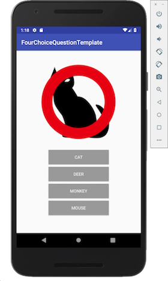

# Androidでクイズアプリ構築
2018.10.16

Android Studioのインストールについては、別紙(setup.key)を参照してください。
本解説は、Android Studio 3.2.1をベースに作成しています。
スクリーンショットが一部、3.1.4ベースになっていますが、相違点がある場合は明記します。

## 作成するプロジェクト
今回はクイズアプリを作成します。下記は最初の画面です。
クイズのカテゴリーが表示されています。カテゴリーを選択するとクイズ画面に遷移します。


画面下部の4つの選択肢から画像に適した物を選びます。


正解すると下記のように「◯」印が表示されます。



不正解の場合、「x」印が表示されます。


「◯」「x」印が表示された状態でタップすると次のクイズへ遷移します。
以上が一連の流れです。

## 新しいプロジェクトの作成
Android Studioを起動します。「Start a new Android Studio project」を選んで新しいプロジェクトを作成（開始）しましょう。


アプリの名前などを決定します。半角の英語で設定してください。


「Target Android Device」などは表示されているままで、そのまま進んでください。
アクティビティは「Empty Activity」を選びます。


この後、プロジェクトの作成と初回のビルドが開始されます。少し待ちましょう。
（この間に、どんなボタンがあるか等、色々覗いて回りましょう）

ビルド完了後、「Code -> Convert Java to Kotlin」と操作して、
プロジェクトをKotlinに変換します。

## アプリケーションの実行

USBケーブルで開発用のマシンとAndroidデバイスを接続してください。
「Connected Devices」の欄にデバイスが表示されていれば、問題ありません。
初回はAndroid端末側で操作が必要なこともありますので、うまくいかない場合は、
Android側の画面も確認して、何か指示やエラーが出ていないかを確認してください。

デバイスが表示されていれば「Ok」をクリックすると、Androidにプログラムが転送され、
アプリが起動します（画面の真ん中にHello world!と表示されます）。

## 新しい画面を追加する

MainActivity.kt 上で右クリックし「File -> Activity -> Empty Activity」を選択し、QuizActivitiy.ktとactivity_quiz.xmlを作成します。


## ボタンを作る

activity_quiz.xmlを編集して、以下のようなレイアウトを作成します。
Androidの端末は様々な画面サイズのものが存在するため、どの画面で見ても使いやすい配置を心がける必要があります。
そのため、画面の座標(x,y)や大きさ(width,height)を直接していするのではなく、相対的な指定、例えば、
画面の端からどのくらい、とか手前のボタンからどのくらい、といった指定を繰り返してボタンや画像を配置することになります。


## 画像を配置する
必要な画像は、自分たちで集めて貰ってもOKですが、著作権に注意してください。
今回のサンプルアプリで使用している画像は、以下のURLからダウンロードできます。
（URLが長いので、まずはgithub.comにアクセスしたあと、four-choice-questionリポジトリを検索した方が確実かもしれません）

https://github.com/lumbermill/four-choice-question/tree/master/assets/images

以下のような著作権フリーの素材から選んできても構いません。

https://www.irasutoya.com/


画像を取得したら

TODO: drawableに置く必然性はある？res/imagesとか？


## クイズのデータを作成する
プログラムの他にデータ（クイズの問題）が必要です。
TODO: Context.ktの作成
「File -> New -> Scratch File」メニューから「Kotlin」を選択します。

```java
print("Hello, World.")

var animals = arrayListOf("hedgehog","dog","turkey")
print(animals)
print(animals[1])
// 存在しない番号はエラーになる
print(animals[3])

// 追加
animals.add("cow")
print(animals)

// 配列を追加する
var ape = arrayListOf("gorilla", "pongo")
animals.addAll(ape)
print(animals)

// 上書き
animals[2] = "bird"
print(animals)

// 中身を検索して削除
animals.remove("dog")
print(animals)

// インデックスを指定して削除
animals.removeAt(1)
print(animals)

var points = hashMapOf("taro" to 3, "jiro" to 5)
print(points)
print(points["taro"])
// 存在しないキーだとnullが返ってくる
print(points["saburo"])

// 追加
points["siro"] = 7
print(points)

// 上書き
points["jiro"] = 4
print(points)

// キーを指定して削除
points.remove("jiro")
print(points)
```

```
class Context {
    companion object {
        val questions: HashMap<String, ArrayList<ArrayList<String>>> = hashMapOf(
                "animal" to arrayListOf(
                        arrayListOf("hedgehog","dog","turkey","cow"),
                        arrayListOf("cow","shrimp","squid","horse"),
                        arrayListOf("pig","bonito","crab","squid"),
                        arrayListOf("cat","monkey","mouse","deer"),
                        arrayListOf("dog","mouse","deer","panda"),
                        arrayListOf("monkey","money","monk","mosquito"),
                        arrayListOf("mouse","monkey","crab","tuna"),
                        arrayListOf("giraffe","deer","tuna","squid"),
                        arrayListOf("bird","sheep","shrimp","bonito"),
                        arrayListOf("horse","bonito","mouse","sheep"),
                        arrayListOf("deer","bear","lion","cow"),
                        arrayListOf("panda","bird","monkey","punk")
                ),
                "fish" to arrayListOf(
                        arrayListOf("","","","")
                )
        )
    }
}
```


## 正誤判定を実装する


## 用語の解説
プロジェクト：
期限や目標が設定されている特定の目的や目的物のこと。

ビルド：
ソースコードのコンパイルなどを行い、実行可能なファイルを作成すること。

Kotlin：
Javaコードと相互運用できるよう設計されたプログラミング言語。Androidの公式言語に追加されている。

Java：
C言語の構文を主に引き継いだプログラミング言語。OSに依存することなくどんな環境でもソフトを動かすことができ、多くの開発現場で使用される。

コンパイル：
ソースコードを解析し、コンピュータが直接実行可能な形式のプログラムに変換すること。

クラス：
オブジェクト指向プログラミングでのオブジェクトの設計図(雛形)のこと。
何らかの階級や分類を表す名称としても使われる。

配列：
複数のデータを連続的に並べたデータ構造。各データをその配列の要素といい、自然数などの添字(インデックス)で識別される。

ハッシュ：
ある一つのデータからそのデータを代表する数値を得るための操作のこと。その数値を得るための関数をハッシュ関数といい、そこから得られた数値のことをハッシュ値と言う。
